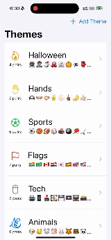

# cs193p
Homework exercises for the spring 2023 Stanford [CS193p](https://cs193p.sites.stanford.edu) course in SwiftUI.

## Memorize! and Set

| Memorize!                                        | Set                                      |
|--------------------------------------------------|------------------------------------------|
|  |  |

A few of the important concepts that I learned in this segment of the course:
- Pinning a view preview in XCode to keep it on-screen when changing scripts you are editing
- Using generics (such as `MemoryGame<CardContent> where CardContent : Equatable`) to specify that there can be multiple types as input provided that they conform to a protocal
- Using opacity to control what aspects of a view are visible, instead of a conditional, when sizing is dependent on view contents
- Using `.aspectRatio` and `minimumScaleFactor` to fit contents nicely within a view that may change sizes
- Initializing ViewModels at the `App` level as `@StateObject`, injected as `@ObservedObject` in views
- Using `protocol` to define structs that have specific properties, then binding variable types to a protocol
- Usage of `static` variables and functions, which are type functions that exist prior to initialization, don't depend on non-static variables, and are constant
- Varying associated data with different cases of enums
- That the `@ViewBuilder` annotation is necessary when a `func` or `var` generates a list of views, but not if you encapsulate a single view
- How to build a custom shape by defining a `Path`
- When a view is first visible on screen it will show with the values its initialized with, it won't animate to those values, animation only occurs when something changes in a view that is already on screen
- Using `.transition(AnyTransition.<...>)` to animate when a view enters or exits the UI
- Using `.matchedGeometry(id: Id, in: Namespace)` to animate views that move from one container to another
- Implicit `.animation` can override explicit `withAnimation { } `
- Using `.transition(.asymmetric(insertion: .identity, removal: .identity))` for when we want to override the default transition, but don't want to specify only `.transition(.identity)` which would have no transition; this works well with the `.matchedGeometry` transition
- Storing related data in tuples, i.e. `(0, causedByCardId: "")`, and unpacking with `let (amount, causedByCardId) = lastScoreChange`
- Number formating in the `Text` object, for example to show the sign of the number
- Using `Color.clear` as a placeholder for when a view has either not showed up yet, or been removed from a container, to make sure the space remains occupied

## Emoji Art

A few of the important concepts that I learned in this segment of the course:
- Using back quotes around a reserved keyword when I want to use it anyway, for example, extending `Emoji.Position` with a function `.in`
- Using `Self` in a static let of a struct to create an instance of its own type
- Using `.draggable` and `.dropDestination` modifiers to enable drag and drop
- `@GestureState` objects are only used changed whiel the gesture is active, after gesture ends, returns to original state, permanent state should be updated in `.onEnded`
- Use `oneGesture.simultaneously(with: otherGesture)` so that multiple gestures can be recognized, one doesn't override the other
- Using `inout` for function arguments that get modified inside the function and copied back out
- The word "Store" is commonly used when creating viewmodels that store data and persist
- Giving an `.id` to a view to make the view get replaced when its contents change, which enables animating transition
- Using `.contextMenu` modifier to add a menu that pops up when you hold onto a view
- Application sandbox contains an application directory (read-only), documents directory (storage visible to user), application support directory (storage not visible to user), caches (temporary storage, not backed up)
- Retrieve the above starting from `URL` with static constants like `URL.documentsDirectory`, etc, then use `.appendingPathComponent` to build onto these paths
- Can create binary data from a URL by `let data = try Data(contentsOf: url)`
- `FileManager` provides various utilities for manipulating data in files
- Implementing `Codable` protocol allows a struct to be encoded into JSON, the variables inside the struct must themselves be `Codable`, includes String, Bool, Int, Double, Float, URL, Array, Dictionary, Set, Date, etc
- If my object is Codable, we can get the JSON representation with `Data = try JSONEncoder().encode(object)`, can do the inverse with `JSONDecoder().decode`
- `try?` (with a question mark) returns `nil` if the operation failed
- `UserDefaults` may be used for persisting very simple data, usually access using `let defaults = UserDefaults.standard`, then `defaults.set(object, forKey: "someKey")` and `let i: Int? = defaults.integer(forKey: "myInteger")` for example
- Three ways to manage an error that is thrown without handling, `try?` ignores, `try!` crashes the program, and `try` inside a function that throws which re-throws it
- Handleing the error requires `do { try functionThatThrows() } catch let error { /* handle the error */ }`
- By adding an init to a struct, you negate the free default init, you must add it back in as `init() {}` if you want it
- If you have an `ObservableObject`, and you want the UI to update on change to a variable that can't be `@Published`, you may invoke the `objectWillChange.send()` method instead
- Cannot encode `let` with a default value, must make it a `var`
- The dollar sign, in example `$emojiArt`, is called the "projected value," in the case of the `@State` this is a binding to the value
- If you mark a `@State` and want to set its value on init of the view, have to use underscore in front of its name, then `.init(initialValue: someValue)`
- Projected value of a `@StateObject` or `@ObservedObject` passes any of the vars inside that viewmodel with a binding
- `@Binding` wraps a value that is bound to something else, projected value is a binding to itself, used for getting text from a `TextField`, value from a `Picker`, important for establishing a single source of truth, variable in one location is a `@State` or `@Published`, the other is a `@Binding`
- `@Environment` is unrelated to `@EnvironmentObject`, documentation of `EnvironmentValues` provides a listing of what is available to modify in the environment, example is `ColorScheme`
- `.popover` can be used similarly to sheet, but will create a modal view that will fill a partial portion of the screen, with an arrow pointing to the view it is attached to
- Using modifier `.focused($focusState, equals: .anEnum)` for when you have multiple text fields in a view, and you want to be able to select focuse between them
- `.navigationDestination` should go outside of the list containing views that invoke the change in value
- Can use `.onDelete` modifier on a `ForEach` to add swipe to delete behavior, but can't do it on the `List` directly, the `ForEach` must be inside the `List`
- Similarly, `.onMove` is used to allow you to drag to change the order of items in the `List`, but must be in the `ForEach`
- To obtain a binding to an object that exists in a store, often you need to first find the index of that object in the store, then put `$` in front of the store itself and index into that object
