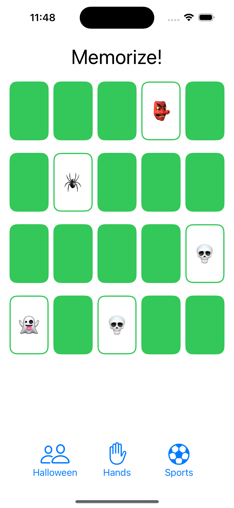
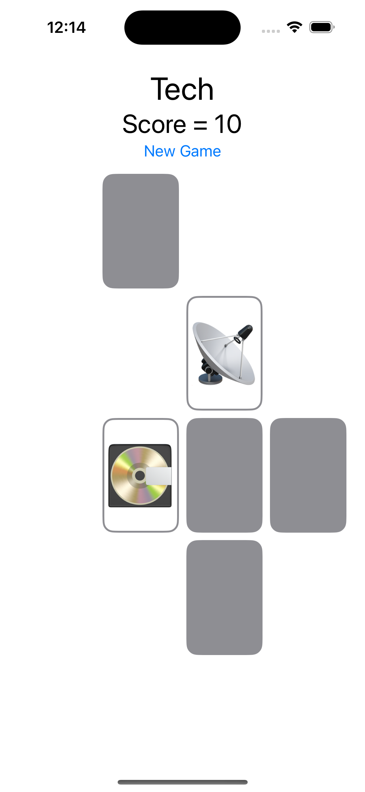

# cs193p
Homework exercises for the spring 2023 Stanford [CS193p](https://cs193p.sites.stanford.edu) course in SwiftUI.

## Memorize!

A few of the important concepts that I learned in this segment of the course:
- Using opacity to control what aspects of a view are visible, instead of a conditional, when sizing is dependent on view contents
- Using `.aspectRatio` and `minimumScaleFactor` to fit contents nicely within a view that may change sizes
- Initializing ViewModels at the `App` level as `@StateObject`, injected as `@ObservedObject` in views
- Using `protocol` to define structs that have specific properties, then binding variable types to a protocol
- Usage of `static` variables and functions, which are type functions that exist prior to initialization, don't depend on non-static variables, and are constant

| Programming Assignment 1 | Post Lecture 4                 | Programming Assignment 2 |
|--------------------------|--------------------------------|--------------------------|
|    |  |    | 
