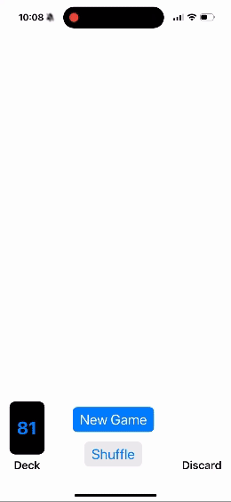

# cs193p
Homework exercises for the spring 2023 Stanford [CS193p](https://cs193p.sites.stanford.edu) course in SwiftUI.

## Memorize! and Set

| Memorize!                                     | Set                                      |
|-----------------------------------------------|------------------------------------------|
|  |  |

A few of the important concepts that I learned in this segment of the course:
- Pinning a view preview in XCode to keep it on-screen when changing scripts you are editing
- Using generics (such as `MemoryGame<CardContent> where CardContent : Equatable`) to specify that there can be multiple types as input provided that they conform to a protocal
- Using opacity to control what aspects of a view are visible, instead of a conditional, when sizing is dependent on view contents
- Using `.aspectRatio` and `minimumScaleFactor` to fit contents nicely within a view that may change sizes
- Initializing ViewModels at the `App` level as `@StateObject`, injected as `@ObservedObject` in views
- Using `protocol` to define structs that have specific properties, then binding variable types to a protocol
- Usage of `static` variables and functions, which are type functions that exist prior to initialization, don't depend on non-static variables, and are constant
- Varying associated data with different cases of enums
- That the `@ViewBuilder` annotation is necessary when a `func` or `var` generates a list of views, but not if you encapsulate a single view
- How to build a custom shape by defining a `Path`
- When a view is first visible on screen it will show with the values its initialized with, it won't animate to those values, animation only occurs when something changes in a view that is already on screen
- Using `.transition(AnyTransition.<...>)` to animate when a view enters or exits the UI
- Using `.matchedGeometry(id: Id, in: Namespace)` to animate views that move from one container to another
- Implicit `.animation` can override explicit `withAnimation { } `
- Using `.transition(.asymmetric(insertion: .identity, removal: .identity))` for when we want to override the default transition, but don't want to specify only `.transition(.identity)` which would have no transition; this works well with the `.matchedGeometry` transition
- Storing related data in tuples, i.e. `(0, causedByCardId: "")`, and unpacking with `let (amount, causedByCardId) = lastScoreChange`
- Number formating in the `Text` object, for example to show the sign of the number
- Using `Color.clear` as a placeholder for when a view has either not showed up yet, or been removed from a container, to make sure the space remains occupied

## Emoji Art

- Using back quotes around a reserved keyword when I want to use it anyway, for example, extending `Emoji.Position` with a function `.in`
- Using `Self` in a static let of a struct to create an instance of its own type
- Using `.draggable` and `.dropDestination` modifiers to enable drag and drop
- `@GestureState` objects are only used changed whiel the gesture is active, after gesture ends, returns to original state, permanent state should be updated in `.onEnded`
- Use `oneGesture.simultaneously(with: otherGesture)` so that multiple gestures can be recognized, one doesn't override the other
- Using `inout` for function arguments that get modified inside the function and copied back out
- The word "Store" is commonly used when creating viewmodels that store data and persist
- Giving an `.id` to a view to make the view get replaced when its contents change, which enables animating transition
- Using `.contextMenu` modifier to add a menu that pops up when you hold onto a view
